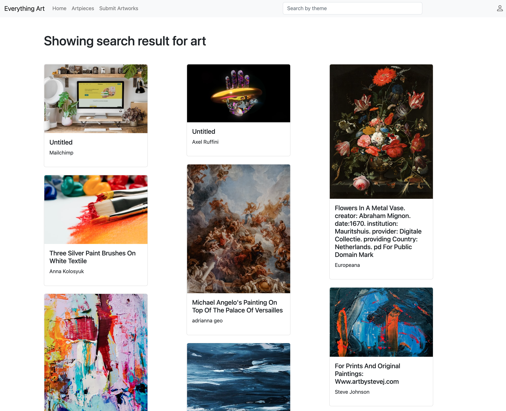

# Everything Art - An Artwork Sharing Website

 

## Deployment Link
https://stark-reef-15518.herokuapp.com/

#### Please use this test user profile to login:
username: jessie 
password: 123123 
username: jacque 
password: 123123 
#### Deployment available until Dec 21
#### The code in Github does not contain API keys, _npm start_ will not be able to connect to Unsplash service and MongoDB.

 

## Introduction
Everything Art was designed to meet the need for easily accessible, high-quality images for use in a variety of environments, such as personal or commercial projects.  It allows users to browse different styles of artwork on it, including photos and paintings. On the website, users can search for artworks on different topics according to their interests, whether they want to search for a specific color, a specific theme, or a specific style.

 

By Jacquelyn (Junting) Xiong & Lynette Huang
Dec 16 2022

 

## Technologies
Frontend: EJS, Bootstrap5, Unsplash API

 

Backend: Express Server, Mongo Atlas, Mongoose, Passport.js

 

 

## Data Model

 

## Screenshots

 

#### 1. Register

#### 2. Login

#### 3. Home page without login for anonymous users

#### 4. Home page for logged-in users

#### 5. Editorial Selection

#### 6. Search

#### 7. Show page for owner

#### 8. Show page for user

#### 9. Profile

#### 10. My Collection

#### 11. Edit Settings

#### 12. Navbar Profile Dropdown

